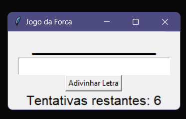

# Jogo da Forca em Python.

Este é um jogo da forca simples implementado em Python usando a biblioteca Tkinter para a interface gráfica.



## Como Jogar 🎮

1. Ao iniciar o jogo, uma palavra secreta é escolhida aleatoriamente a partir de uma lista de palavras pré-definidas.

2. O jogador pode adivinhar uma letra por vez, inserindo-a no campo de entrada de letra.

3. Se a letra estiver na palavra secreta, ela será revelada na palavra oculta. Caso contrário, o jogador perderá uma tentativa.

4. O jogador ganha o jogo se conseguir adivinhar a palavra secreta antes de acabarem as tentativas.

5. O jogador perde o jogo se as tentativas acabarem antes de adivinhar a palavra secreta.

## Como Executar 🚀

Certifique-se de ter Python instalado em seu sistema. Você também precisará da biblioteca Tkinter, que geralmente já está incluída na instalação padrão do Python.

1. Clone o repositório:

   ```bash
   git clone https://github.com/seu-usuario/jogo-da-forca-python.git
   ```

2. Navegue até o diretório do projeto:

   ```bash
   cd jogo-da-forca-python
   ```

3. Execute o jogo:

   ```bash
   python jogo_da_forca.py
   ```

## Personalização 💅

Você pode personalizar o jogo adicionando mais palavras à lista `palavras` no arquivo `forca.py`. Isso tornará o jogo mais interessante com uma variedade de palavras secretas possíveis.

## Contribuições 🙋

Contribuições são bem-vindas! Sinta-se à vontade para abrir problemas (issues) ou enviar solicitações de pull (pull requests) para melhorar este projeto.

## Autor 👔

Este jogo foi desenvolvido por [Ródiney Wanderson](https://github.com/rodineyw).

## Licença 📚

Este projeto está licenciado sob a [Licença MIT](LICENSE).