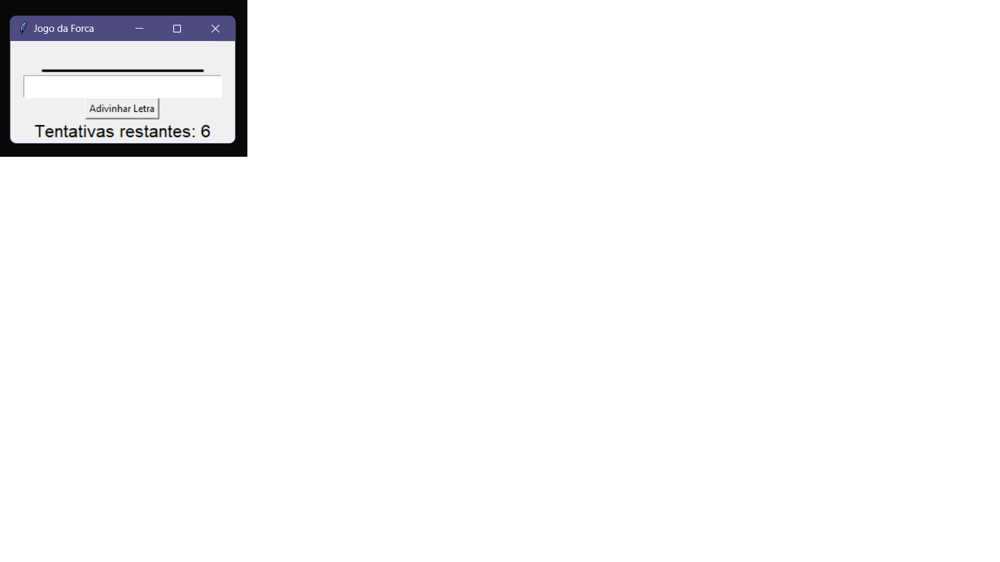

# Projeto Python Iniciante - Jogo da Forca.

<figure>
  
 <figcaption>Interface do game</figcaption>
</figure>

### Descrição.

- O arquivo "requeriments.txt" está listado todas as Lib que utilizei nesse projeto. 

Divirta-se!